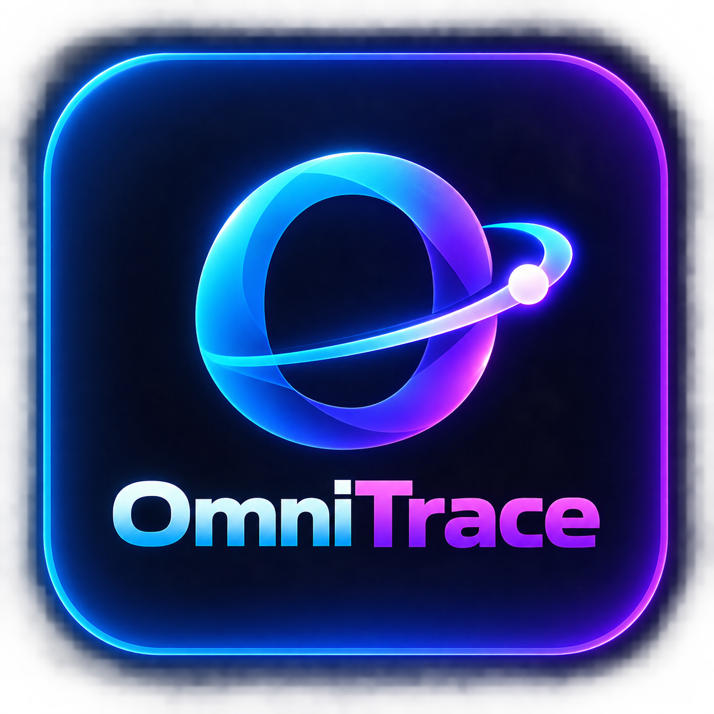
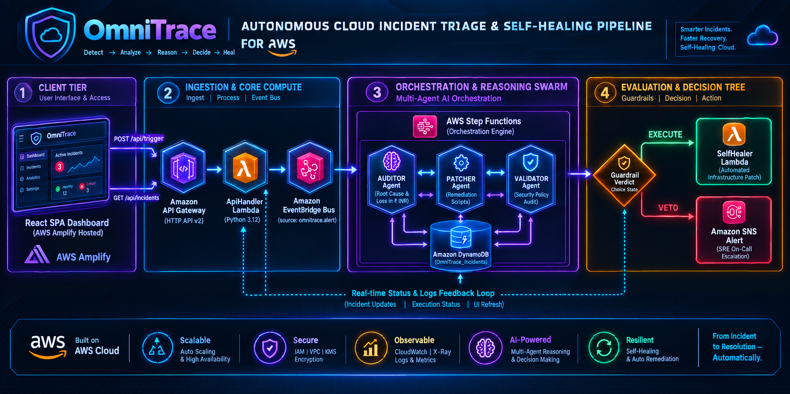

<div align="center">
  

# OmniTrace — Autonomous Cloud Incident Triage & Self-Healing Pipeline

> **Track 2: Ship It** — AWS Serverless Hackathon submission  
> Powered by **Amazon Bedrock Nova Pro**, **Step Functions**, **EventBridge**, **Lambda**, **DynamoDB**, and **API Gateway**

</div>

---

## 🏗️ Architecture Overview



> **4-tier pipeline:** Client Tier → Ingestion & Core Compute → Orchestration & Reasoning Swarm → Evaluation & Decision Tree

The pipeline flows across four tiers:

| Tier | Components | Role |
|------|-----------|------|
| **① Client Tier** | React SPA (AWS Amplify) | Dashboard UI — trigger incidents, view pipeline, monitor status |
| **② Ingestion & Core Compute** | API Gateway → ApiHandler Lambda → EventBridge | Receives alert, emits `omnitrace.alert` event |
| **③ Orchestration & Reasoning Swarm** | Step Functions → AUDITOR + PATCHER + VALIDATOR (Bedrock Nova Pro) + DynamoDB | 3-agent AI pipeline for root cause → remediation → safety audit |
| **④ Evaluation & Decision Tree** | Guardrail Choice State → SelfHealer Lambda **or** Amazon SNS Alert | EXECUTE: auto-patch · VETO: escalate to SRE on-call |

A **Real-time Status & Logs Feedback Loop** runs continuously from DynamoDB back to the React dashboard, providing live incident updates and UI refresh.

---

## ✅ AWS Services Utilized

| Service | Purpose |
|---|---|
| **Amazon Bedrock** (Nova Pro) | AI agents for root-cause analysis, command generation, and safety validation |
| **AWS Step Functions** | Orchestrates the 3-agent pipeline with Choice state for VETO/EXECUTE routing |
| **Amazon EventBridge** | Receives `omnitrace.alert` events and triggers the state machine |
| **AWS Lambda** (Python 3.12) | Agent Dispatcher, Self-Healer, API Handler |
| **Amazon DynamoDB** | Persists all incident records, agent reasoning trails, and resolution logs |
| **Amazon API Gateway** (HTTP API v2) | REST API consumed by the React SPA |
| **AWS Amplify** | Hosts the React + Vite + Tailwind CSS frontend |
| **Amazon CloudWatch** | Logs, metrics, and alarms for the full pipeline |
| **AWS IAM** | Least-privilege roles for every Lambda and the Step Functions state machine |

---

## 📁 Project Structure

```
omni-trace/
├── template.yaml                    # AWS SAM / CloudFormation template
├── samconfig.toml                   # SAM CLI deployment configuration
├── backend/
│   └── handlers/
│       ├── agent_dispatcher.py      # AUDITOR + PATCHER + VALIDATOR agents (Bedrock)
│       ├── api_handler.py           # REST API (GET /incidents, POST /trigger)
│       ├── self_healer.py           # Executes remediation, marks RESOLVED
│       └── requirements.txt         # Python dependencies
├── frontend/
│   ├── index.html
│   ├── package.json
│   ├── vite.config.js
│   ├── tailwind.config.js
│   ├── postcss.config.js
│   ├── .env.example
│   └── src/
│       ├── main.jsx
│       ├── index.css
│       └── App.jsx                  # Full SRE dashboard SPA
├── cdk/                             # Optional CDK stack (pre-existing)
└── README.md
```

---

## 🚀 Deployment Guide

### Prerequisites

```bash
# Install AWS SAM CLI
pip install aws-sam-cli

# Python 3.13 required (3.11 also works if you update the runtime in template.yaml)
python --version   # confirm 3.13 is on PATH

# Install Node.js 18+ for frontend
# Ensure AWS credentials are configured
aws sts get-caller-identity
```

### 1️⃣ Enable Amazon Bedrock Model Access

In the AWS Console → **Amazon Bedrock → Model access**:
- Enable **Amazon Nova Pro** (`amazon.nova-pro-v1:0`)

### 2️⃣ Backend Deployment (SAM)

```bash
# Clone and enter repo
cd omni-trace

# Build all Lambda functions
sam build

# Deploy to AWS (interactive — fill in your S3 bucket and stack name)
sam deploy --guided

# On subsequent deploys:
sam deploy
```

**SAM deploy will output:**
```
Outputs:
ApiEndpoint    = https://xxxxxxxxxx.execute-api.us-east-1.amazonaws.com/prod
DynamoDBTable  = OmniTrace_Incidents
StateMachineArn = arn:aws:states:us-east-1:...
```

> ⚠️ Copy the `ApiEndpoint` output — you need it for the frontend.

### 3️⃣ Frontend Deployment (AWS Amplify)

**Option A — Amplify Console (Recommended)**

1. Push this repository to GitHub / CodeCommit / Bitbucket
2. Go to **AWS Amplify → New App → Host web app**
3. Connect your repository and branch
4. Set build settings:

```yaml
version: 1
frontend:
  phasves:
    preBuild:
      commands:
        - cd frontend
        - npm ci
    build:
      commands:
        - npm run build
  artifacts:
    baseDirectory: frontend/dist
    files:
      - '**/*'
  cache:
    paths:
      - frontend/node_modules/**/*
```

5. Add environment variable in Amplify console:
   - Key: `VITE_API_URL`
   - Value: `https://xxxxxxxxxx.execute-api.us-east-1.amazonaws.com/prod`

6. Save and deploy.

**Option B — Local development**

```bash
cd frontend
cp .env.example .env.local
# Edit .env.local and set VITE_API_URL to your ApiEndpoint

npm install
npm run dev
# Visit http://localhost:3000
```

**Option C — Manual S3 + CloudFront**

```bash
cd frontend
npm install
npm run build

# Create S3 bucket for hosting
aws s3 mb s3://omnitrace-dashboard-$(date +%s)

# Upload build
aws s3 sync dist/ s3://YOUR_BUCKET_NAME --delete

# Or use AWS CLI to create CloudFront distribution
```

---

## 🔧 Local Testing

### Test individual Lambda handlers locally:

```bash
# Test API Handler
sam local invoke OmniTraceApiHandler --event events/trigger.json

# Test Agent Dispatcher (AUDITOR role)
sam local invoke OmniTraceAgentDispatcher --event events/auditor.json

# Start local API
sam local start-api --port 8080
```

### Sample event files:

**`events/trigger.json`**
```json
{
  "requestContext": { "http": { "method": "POST" } },
  "rawPath": "/api/trigger",
  "body": "{\"triggeredBy\": \"test\"}"
}
```

**`events/auditor.json`**
```json
{
  "agent_role": "AUDITOR",
  "incident": {
    "incidentId": "INC-TEST-001",
    "service": "omnitrace-api",
    "errorType": "MEMORY_EXHAUSTION",
    "severity": "P1",
    "region": "us-east-1",
    "errorLogs": "[ERROR] Lambda runtime exited: signal: killed\n[CRITICAL] Memory 512/512 MB exhausted",
    "timestamp": "2025-01-15T14:30:00Z"
  }
}
```

---

## 📊 Key Design Decisions

| Decision | Rationale |
|---|---|
| **Nova Pro model** | Optimal for structured JSON output, strong reasoning at low cost |
| **Bedrock Converse API** | Unified API across models, supports system prompts cleanly |
| **3-agent sequential pipeline** | Separation of concerns — each agent specializes in one task |
| **VETO safety gate** | Prevents autonomous execution of destructive operations |
| **DynamoDB for agent state** | Full audit trail of every reasoning step, queryable by incidentId |
| **EventBridge as trigger** | Decouples simulation from pipeline — real CloudWatch alarms can fire the same event |
| **HTTP API v2** | Lower latency and cost than REST API for simple CRUD operations |
| **INR cost estimates** | India-first audience, more relatable for the hackathon demographic |

---

## 🛡️ Security Notes

- All Lambda functions use least-privilege IAM roles
- Bedrock model access is scoped to specific model ARNs
- DynamoDB access is scoped to the single OmniTrace_Incidents table
- API Gateway has CORS configured (restrict `AllowOrigins` to your Amplify domain in production)
- VALIDATOR agent acts as a mandatory safety gate before any auto-remediation

---

## 📈 Extending OmniTrace

1. **Connect real CloudWatch Alarms**: Replace the UI trigger with an EventBridge rule matching `aws.cloudwatch` alarm state changes
2. **Add SNS notifications**: Subscribe an SNS topic to send escalation emails when VALIDATOR issues VETO
3. **Multi-region support**: Deploy the stack to multiple regions and use EventBridge cross-region targets
4. **Slack integration**: Add a Lambda step after VETO to post to Slack with an approve/reject button
5. **Historical analytics**: Add a Glue + Athena pipeline over DynamoDB exports for incident analytics

---

## 📝 License

MIT — Built for the AWS Serverless Hackathon, Track 2: Ship It.
